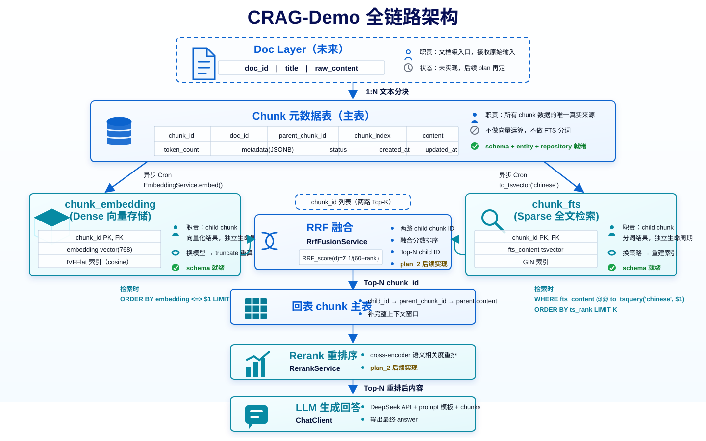

# CRAG-Demo

基于 RAG（检索增强生成）的开箱即用问答机器人后端服务。

## 项目简介

CRAG-Demo 是一个基于 Java 21 + Spring Boot 构建的 RAG 问答系统后端，使用 PostgreSQL + pgvector 作为向量数据库，通过 Docker Compose 一键部署所有依赖服务。

## 全链路架构



更多项目介绍内容后续沉淀在 [项目介绍文档](./doc/project_intro.md)。

## 特性

- 🔌 **开箱即用**：Docker Compose 一键启动，包含所有中间件
- 🧠 **RAG 架构**：文档分块 → 向量化 → 语义检索 → 重排序 → LLM 生成
- 📦 **全容器化**：PostgreSQL + pgvector + Spring Boot 全部 Docker 化
- 🔗 **统一 LLM 接口**：磨平不同 LLM 提供商差异，可灵活切换
- 📐 **清晰分层**：`crag-app` 统一启动，`crag-admin` 承载 HTTP 入口，领域能力按 module 隔离

## 技术栈

- **语言**：Java 21
- **框架**：Spring Boot 3.x
- **构建**：Gradle（Kotlin DSL）
- **向量数据库**：PostgreSQL + pgvector
- **容器化**：Docker + Docker Compose

## 快速开始

```bash
# 克隆项目
git clone <repo-url>
cd CRAG-Demo

# 一键启动
docker compose up -d --build

# 验证服务
curl http://localhost:8080/api/v1/test/smoke
```

## API 接口

### 用户查询

```http
POST /api/v1/query
Content-Type: application/json

{
  "question": "什么是 RAG？"
}
```

### 管理端上传

```http
POST /api/v1/admin/rag
Content-Type: multipart/form-data
```

## 项目结构

```
├── crag-common/      # 跨模块共享的基础类型、统一响应结构
├── crag-storage/     # JPA entity、repository、dao
├── crag-ingestion/   # AdminRag 写入链路、ChunkSplit、Dense/Sparse 索引写入 Cron
├── crag-retrieval/   # Sparse/Dense 查询召回、RRF、Rerank、Embedding client
├── crag-query/       # UserQuery 编排、Prompt 组装、LLM 调用
├── crag-admin/       # HTTP API service：Controller、请求 DTO、异常处理
├── crag-app/         # 唯一 Spring Boot 启动模块，承载 application.yml/schema.sql/data.sql
└── plan/             # 项目规划文档（plan_main + index + plan_N 目录）
```

## 开源协议

MIT License — 详见 [LICENSE](./LICENSE)
