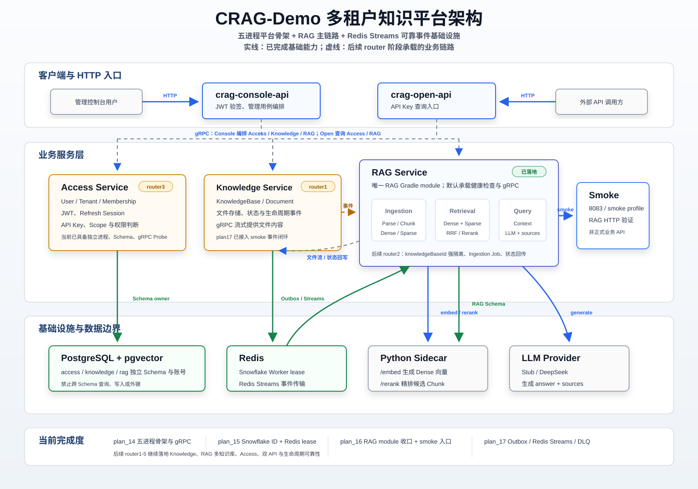

# CRAG-Demo

开箱即用的 RAG 全链路学习项目。Clone → `docker compose up` → 5 分钟看懂检索增强生成的每一步。


## ⚡ 5 分钟快速开始

### 前置条件

- Docker Desktop 或 Docker Engine
- Git

### 一键启动

```bash
git clone <repo-url> && cd CRAG-Demo
docker compose up -d --build
```

等待健康检查通过（约 90 秒，首次需下载模型约 2 分钟）。

> 💡 Compose 启动五个 Java 服务（console-api、open-api、access-service、knowledge-service、rag-service）、PostgreSQL、Redis 和 Sidecar。三个业务服务固定暴露本地诊断端口（Access 8091、Knowledge 8092、RAG 8082）；默认只暴露 `/actuator/health/**`。RAG 写入与问答的 HTTP 验证入口在 `smoke` Profile 下由原 `rag-service`（8082）的 `/api/v1/smoke/**` 条件 Controller 提供。

### 写入知识 + 发起问答

默认 `docker compose up` 的 `rag-service`（8082）只暴露健康检查与 gRPC；RAG 写入与问答的 HTTP 验证入口在 `smoke` Profile 下。设置 `CRAG_SERVICE_PROFILES=smoke` 重建 `rag-service` 后从同一端口 8082 调用 `/api/v1/smoke/**`：

```bash
# 启用 smoke Profile 重建 rag-service（同端口 8082，注册 /api/v1/smoke/** 验证端点）
CRAG_SERVICE_PROFILES=smoke docker compose up -d --build rag-service

# 1. 写入一篇中文知识
curl -X POST http://localhost:8082/api/v1/smoke/admin/rag \
  -H "Content-Type: application/json" \
  -d '{"title":"RAG 介绍","content":"RAG（检索增强生成）是一种结合信息检索与文本生成的技术架构。它先从知识库中检索相关文档片段，再将这些片段作为上下文交给大语言模型生成答案，从而有效减少幻觉、提升回答的事实准确性。"}'

# 2. 等待索引构建完成（约 10 秒）
sleep 10

# 3. 发起问答
curl -X POST http://localhost:8082/api/v1/smoke/query \
  -H "Content-Type: application/json" \
  -d '{"question":"什么是 RAG？"}'
```

> 💡 默认使用 **Stub 模式**，无需任何 API Key 即可跑通全链路。想接入真实 LLM？设置 `CRAG_QUERY_LLM_PROVIDER=deepseek` 并配置相关环境变量即可（详见 `.env.example`）。

### 服务端口

| 服务 | HTTP 端口 | 说明 |
| --- | --- | --- |
| `console-api` | 8080 | Console HTTP 入口 |
| `open-api` | 8081 | Open HTTP 入口 |
| `rag-service` | 8082 | RAG 运行时（健康检查 + gRPC；启用 `CRAG_SERVICE_PROFILES=smoke` 后同端口暴露 `/api/v1/smoke/**`） |
| `knowledge-service` | 8092 | Knowledge 服务（启用 `CRAG_SERVICE_PROFILES=smoke` 后同端口暴露 `/api/v1/smoke/knowledge/**`） |
| `access-service` | 8091 | Access 服务（启用 `CRAG_SERVICE_PROFILES=smoke` 后同端口暴露 `/api/v1/smoke/access/**`） |

### Smoke 诊断模式

Smoke 模式提供分阶段诊断端点，需显式 `smoke` Profile 激活（plan_21/21.11 收敛单服务 Smoke 拓扑，原服务固定暴露本地诊断端口，不再创建 `*-smoke` 重复容器）：

```bash
# 启用 RAG smoke（同端口 8082）
CRAG_SERVICE_PROFILES=smoke docker compose up -d --build rag-service
curl http://localhost:8082/api/v1/smoke/test/smoke

# 启用 Access smoke（同端口 8091）：身份/会话/Membership/API Key
CRAG_SERVICE_PROFILES=smoke docker compose up -d --build db redis access-service
curl http://localhost:8091/api/v1/smoke/access/jwt-keys
```

## 📑 正式 API 契约（Console / Open）

router4 / plan_21 已交付两份 OpenAPI 3.1 文档与中文前端交接指南，同仓库前端可直接生成客户端并完成联调：

- [API 前端交接指南](./docs/api/README.md) — 登录态、Cookie、Tenant 上下文、分页、上传/轮询/重试、Scope 部分成功、一次性 API Key、Open Query、统一错误处理。
- [Console API](./docs/api/console-api.openapi.yaml)（`console-api:8080`，auth/tenant/membership/knowledge/document/apikey）
- [Open API](./docs/api/open-api.openapi.yaml)（`open-api:8081`，单 KB API Key 问答 `POST /api/v1/query`）

生成客户端：`openapi-generator-cli generate -i docs/api/console-api.openapi.yaml -g typescript-fetch -o ./frontend/console-client`。契约校验已纳入 `./gradlew check`（`python3 scripts/validate_openapi.py`，覆盖解析、openapi=3.1、operationId 唯一、`$ref`、示例匹配、路由清单漂移、Markdown 链接）。

## 🗺️ 平台架构



> 上图反映当前平台方向：五个 Java 进程、gRPC 服务通信、PostgreSQL 独立 Schema、Redis Streams 可靠事件基础设施，以及仍作为核心的 RAG 主链路。实线表示已落地基础能力，虚线表示后续 router 阶段继续实现的业务链路。

### router2：RAG 多知识库化（plan_19）

RAG 已从单知识空间升级为多知识库隔离模型（见 `plan/plan_19`）：

- **事件驱动摄入**：RAG 订阅 Knowledge 发布的 `DOC_UPLOADED`（Redis Streams，独立消费组 `rag-ingestion`），通过 Knowledge gRPC `ReadDocumentFile` 读取文件，校验 sha256/size/fileType 后切分写入；以 `(docId, operationVersion)` 为业务幂等键建立 `ingestion_job`，状态 `PENDING → PROCESSING → READY / FAILED`。
- **按 KB 强隔离**：`chunk` / `chunk_embedding` / `chunk_fts` 三表显式落 `knowledge_base_id`，Sparse / Dense 查询、Rerank 相邻扩展、Parent Evidence 回表与 Query 入口均以 `knowledgeBaseId` 为必填强隔离键（`retrieve` / `retrieveEvidence` / `answer` 均接收 `knowledgeBaseId`）。
- **状态事件**：RAG 发布 `INGESTION_PROCESSING / INGESTION_READY / INGESTION_FAILED` 状态事件（payload 仅含安全字段）。
- **诊断**：router2 全链路在 smoke profile 下通过原 `rag-service`（8082）+ 原 `knowledge-service`（8092）的 `/api/v1/smoke/**` HTTP 入口验证（见 `scripts/tests/http/rag_smoke_*.sh`）。

### router3：Access 垂直链路（plan_20）

Access 已落地为完整的身份与授权 Provider（见 `plan/plan_20`）：

- **身份与会话**：User / Login Account 分离，Username/密码注册（Argon2id）与默认 Tenant + OWNER Membership；身份型 RS256 JWT（仅 `sub/sid/jti/iss/aud/iat/nbf/exp`，不含 Tenant/角色）与单次轮换、复用检测撤销整个 Family 的 Refresh Session。
- **Membership**：OWNER/MEMBER 固定权限矩阵、按 Username 添加成员、最后 OWNER 并发保护、跨租户不泄漏。
- **API Key**：KnowledgeBase 授权投影（Scope）+ 单 Key 完整生命周期（创建/鉴权/停用/启用/轮换/吊销/过期），完整 Key 只返回一次。
- **失效事件**：Key/Scope 状态变化在同事务写 `API_KEY_INVALIDATED` Outbox，经 Redis Streams 发布（router4 消费）。
- **诊断**：router3 全链路在 smoke profile 下通过原 `access-service`（8091）的 `/api/v1/smoke/access/**` HTTP 入口验证（见 `scripts/tests/http/access_smoke_*.sh`）；默认 profile 只暴露 gRPC。

### router4：双 API 与摄取生命周期（plan_21）

Console/Open 正式 HTTP 与 Knowledge 摄取生命周期已落地为完整产品链（见 `plan/plan_21`）：

- **Console API**（`console-api:8080`）：register/login/refresh/logout/me（RS256 JWT 只进响应体，Refresh Token 只进 HttpOnly Cookie，Origin/Referer 同站校验）、Tenant list、Membership list/add/change-role/remove、KnowledgeBase list/create/get（建库 201 + Scope 部分成功 `apiKeyReady=false`，KB_CREATED consumer 补偿）、Document list/upload/get/retry（multipart 10MiB/.txt/.md/UTF-8，upload 202 PENDING）、API Key list/get/create/disable/enable/rotate/revoke（完整 Key 只 create/rotate 一次性返回，OWNER-only）。
- **Open API**（`open-api:8081`）：`POST /api/v1/query` 通过单 KB API Key 鉴权（SHA-256 指纹缓存 TTL 30s，Key/Scope 版本水位 + Ephemeral Redis consumer 主动 evict），question 1–2000，answer + sources（reference/documentId/excerpt）。
- **摄取生命周期**：Document `PENDING → PROCESSING → READY/FAILED` 状态机（CAS + operationVersion）、retry（新版本 + attempt 递增 + 退避 30/120s + attempt 3 截止）、Reconciler（Spring TaskScheduler 驱动，滞留 PENDING/PROCESSING 通过 RAG IngestionStatus RPC 收敛或超时终态化）、RAG ingestion head 单调推进 + READY 版本隔离（旧/FAILED/PROCESSING/部分索引零召回）。
- **全链路回归**：router4 完整产品链由 `scripts/tests/http/router4_*.sh`（9 个脚本）通过完整 Compose（Console + Open + Access + Knowledge + RAG + db + redis + sidecar）验证 Auth、Membership、Scope 恢复、上传 + Query、retry、Reconcile、Key 失效消费、多租户隔离与 Smoke Profile 拓扑（见 `scripts/tests/http/router4_*.sh`）。
- **已知缺口**（plan_21 待验收判定）：(1) Knowledge `DocumentGrpcProvider.retryIngestion` 尚未重写，真实 retry 链路在 provider 接线前返回 UNIMPLEMENTED；(2) Access Membership proto 无 `nickname` 字段，Console membership list 返回 `nickname=null`。

## 🔢 RAG 管道：7 步走通检索增强生成

### 写入链路

**① 文档入库** `POST /api/v1/smoke/admin/rag` → `crag-rag-service`

你上传的文本存入 `document` 表，状态标记 `PENDING_CHUNK`。文档与 Chunk 的业务 ID 由 `crag-id` 以 Snowflake `BIGINT` 分配（HTTP 边界以 decimal string 输出，避免前端精度损失）。
👉 代码入口：`crag-rag-service` Controller → `crag-rag-service` AdminRagService

**② 文档分块** Cron: `DocChunkSplitListener`

定时扫描待处理的文档，按句子边界切分为 Chunk，写入 `chunk` 表。
👉 代码入口：`crag-rag-service` / Cron / DocChunkSplitListener

**③ 索引构建** Cron: `SparseIndexListener` + `DenseIndexListener`

Chunk 变更后，分别构建：
- **Dense 向量索引**：调用 Python Sidecar `/embed`（gte 中文模型）→ 写入 pgvector
- **Sparse 全文索引**：分词后写入 `sparse_index` 表
👉 代码入口：`crag-rag-service` / Cron，Sidecar 交互见 `crag-rag-service` EmbeddingClient

### 查询链路

**④ 双路召回** `POST /api/v1/smoke/query` → `crag-rag-service`

用户问题同时走两路：
- **Dense 语义召回**：问题向量化 → pgvector 余弦相似度 Top-K
- **Sparse 关键词召回**：分词 → 全文检索 Top-K
👉 代码入口：`crag-rag-service` / SparseRetrievalService、DenseRetrievalService

**⑤ RRF 融合** `crag-rag-service` / RRF

Reciprocal Rank Fusion 合并双路结果，去重后重排。
👉 代码入口：`crag-rag-service` / RrfService

**⑥ Rerank 重排序** `crag-rag-service` → Sidecar `/rerank`

用 bge-reranker-v2-m3 模型对候选 Chunk 精排，取 Top-N。
👉 代码入口：`crag-rag-service` / RerankClient

**⑦ LLM 生成** `crag-rag-service` → LLM

精排后的 Chunk 作为 Context 拼入 Prompt，调用 LLM 生成最终答案 + 来源引用。
👉 代码入口：`crag-rag-service` / QueryService → LLM Client

### 一张图总结

| 步骤 | 阶段 | 模块 | 关键动作 |
|------|------|------|----------|
| ① | 写入 | ingestion | 文档入库 |
| ② | 写入 | ingestion | 分块（Cron） |
| ③ | 写入 | ingestion + retrieval | Dense / Sparse 索引 |
| ④ | 查询 | retrieval | 双路召回 |
| ⑤ | 查询 | retrieval | RRF 融合 |
| ⑥ | 查询 | retrieval | Rerank 重排 |
| ⑦ | 查询 | query | LLM 生成答案 |

## 📦 项目结构

```
├── crag-common/              # 跨模块共享：统一响应结构、基础异常类型
├── crag-id/                  # 分布式 Snowflake ID 基础设施：发号、Redis Worker 租约、时钟回拨处理
├── crag-platform-contracts/  # 跨领域通用 Protobuf 基础契约（Platform Probe）
├── crag-knowledge-contracts/ # Knowledge 领域 Protobuf/gRPC 契约（KnowledgeBase、Document）
├── crag-access-contracts/    # Access 领域 Protobuf/gRPC 契约（Identity、Membership、ApiKey）
├── crag-grpc-runtime/        # 协议无关 gRPC Server/Client 生命周期、认证、Health
├── crag-event/               # 领域无关可靠事件基础设施：Outbox、processed_event、Redis Streams、ACK/Reclaim/DLQ
├── crag-rag-service/         # RAG 业务组合根：storage/retrieval/query/ingestion 内部包 + smoke 验证 HTTP + gRPC Server
├── crag-access-service/      # Access 组合根：身份/会话/Membership/API Key + JWT + 安全适配器 + gRPC Server + smoke 验证 HTTP
├── crag-knowledge-service/   # Knowledge 组合根：KnowledgeBase/Document/文件上传/DOC_UPLOADED + gRPC Server + smoke 验证 HTTP
├── crag-console-api/         # Console HTTP 入口、下游 Probe readiness
├── crag-open-api/            # Open HTTP 入口、下游 Probe readiness
├── sidecar/                  # Python 模型 Sidecar：/embed（gte）、/rerank（bge-reranker）
├── plan/                     # 项目规划文档与设计决策
├── constraints/              # 编码规范与架构约束
└── scripts/                  # 运维与验收脚本
```

> 💡 **学习路径**：建议从 `crag-rag-service` 的 smoke Controller（HTTP 验证入口）→ query 包（核心编排）→ retrieval 包（检索细节）→ ingestion 包（写入链路）的顺序阅读代码。

## 🛠️ 技术栈

| 层次 | 技术 | 说明 |
|------|------|------|
| 语言 | Java 21 | 虚拟线程、Record、密封类 |
| 框架 | Spring Boot 4.1 | Spring Framework 7 + Spring AI 2.0 |
| 构建 | Gradle (Kotlin DSL) | 多模块项目统一管理 |
| ORM | Spring Data JPA | 基于 Hibernate 的声明式持久层 |
| 向量库 | PostgreSQL 17 + pgvector | 向量存储、余弦相似度检索 |
| 协调 | Redis 7.4 | Snowflake ID Worker 租约 + Redis Streams 可靠事件传输（传输层，非业务事实来源） |
| 嵌入模型 | gte (GTE Chinese) | 中文句向量，Python Sidecar 托管 |
| 重排模型 | bge-reranker-v2-m3 | 跨语言重排序，Python Sidecar 托管 |
| LLM | Stub / DeepSeek | Stub 免 Key 调试；DeepSeek 生产可用 |
| 容器 | Docker + Compose | 五进程拓扑一键编排 |

## 📄 许可证

MIT License — 详见 [LICENSE](./LICENSE)

## ⚠️ 安全提示

DEBUG 日志会记录用户问题与模型回答。**禁止在生产环境开启。** 默认 `INFO` 级别不记录任何问答内容。Context、Prompt、认证信息在任何日志级别下均不记录。
