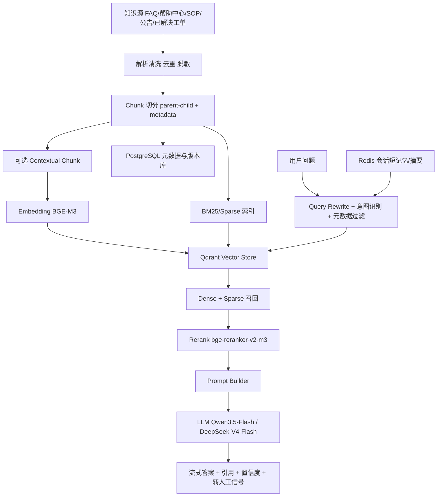

# 基于 Java 与 Spring Boot 生态落地客服问答机器人的可行方案

## 执行摘要

如果你要从零搭一个面向中文客服场景、以 Java 和 Spring Boot 为主的问答机器人，我建议优先采用“**Spring Boot + Spring AI + Qdrant + Redis + PostgreSQL + BGE-M3 + bge-reranker-v2-m3 + 商用 LLM API**”的组合：Spring AI 提供统一的 Chat、Embedding、VectorStore、流式调用和可观测能力，便于后续替换模型与向量库；BGE-M3 同时支持 dense / sparse / multi-vector、多语言和长文本，官方也明确建议在 RAG 中采用“混合检索 + rerank”；Qdrant 对过滤检索、混合查询和磁盘换内存都更友好，适合作为 0→1 阶段的默认向量库。在线生成层默认用 **Qwen3.5-Flash** 或 **DeepSeek-V4-Flash** 控成本与延迟，复杂问题再升级到更强模型；若未来要求“知识不出域”，再切到 **Qwen3-30B-A3B-Instruct-2507 + vLLM** 的本地部署路线。citeturn29view3turn26view0turn26view1turn25view2turn25view3turn18view4turn19view0turn21view2turn35view0

不建议第一阶段就做“超长上下文塞满全文”“记忆长期个性化”“GraphRAG”“复杂 Agent 工作流”。更稳妥的路径是先把 **知识清洗、chunk 策略、混合召回、重排序、引用回传、无答案降级** 做扎实。等离线评测和线上投诉数据稳定后，再引入“上下文化 chunk / contextual retrieval”“长对话摘要记忆”“多模型路由”。Anthropic 的工程实践表明，给 chunk 增加上下文并结合 BM25 与 rerank，能显著降低检索失败率，但这会提高预处理复杂度，更适合放到第二阶段。citeturn34view0turn27search4

## 项目假设与边界

下表是本报告未被你显式指定、但工程上必须先定下来的假设；这些假设直接影响向量库、模型、缓存和部署路线。

| 假设项 | 本报告采用的默认假设 | 对方案的影响 |
|---|---|---|
| 服务对象 | 中文客服问答，覆盖 FAQ、SOP、售后政策、产品说明、公告 | 适合“检索增强问答”，不把模型放到交易决策链路 |
| 峰值并发 | 峰值 30 QPS，月问答量约 20 万次 | API LLM 可先跑通；无需首期自建大规模 GPU 集群 |
| 时延目标 | p95 首 token < 1.5s，完整回答 < 4s | 必须做流式输出、缓存、召回限流、轻量 rerank |
| 语言范围 | 中文为主，兼容中英混输 | Embedding 和 rerank 需具备多语言能力 |
| 外部 API 付费 | 允许，但订单/个人信息需先脱敏再出域 | 推荐“本地 RAG + 云端 LLM”；合规敏感场景预留本地 LLM 替换位 |
| 对话历史 | 保留会话级短期历史，不做长期个体画像 | Redis 会话记忆即可，避免一开始做复杂 memory |
| 知识更新 | T+5 分钟增量更新即可，不要求秒级 | 采用异步 ingestion，避免在线链路写入向量库 |
| 知识规模 | 1–5 万源文档，切分后约 30–80 万 chunks | Qdrant/pgvector 足够；无需首期上 Milvus 集群 |
| 回答要求 | 必须可引用来源、可回溯版本、找不到就明确说不知道 | Prompt、日志、审计、版本控制要内建 |

在这些假设下，首期目标不是“让模型什么都能答”，而是“**对知识库内问题稳定答对，对知识库外问题稳定拒答/转人工**”。这也是 RAG 项目能否进入生产的核心分界线。citeturn27search1turn27search4

## 推荐架构总览



Java 侧建议把系统拆成三块：**chat-orchestrator** 负责在线问答编排，**kb-ingest** 负责知识清洗和索引构建，**ops-console** 负责评测、观测和版本回滚。Spring AI 已提供模块化 RAG 架构、`QuestionAnswerAdvisor`、`RetrievalAugmentationAdvisor`、向量库抽象、可移植过滤表达式，以及同步/流式两种调用方式，因此 Java 侧更适合做“编排层、策略层、治理层”，而不是把模型推理直接塞进 JVM。citeturn29view1turn29view3turn29view2

## RAG 层方案

向量库选型建议不要只看检索性能，而要同时看 **元数据过滤、混合检索、数据持久化、已有技术栈复用、运维复杂度**。下面这张表更适合你这种“Java 后端团队从零落地”的语境。

| 存储方案 | 向量维度上限 | 典型索引 | 持久化与扩展 | 成本判断 | 推荐场景 |
|---|---:|---|---|---|---|
| pgvector | `vector` 2000，`halfvec` 4000 | HNSW、IVFFlat | 直接复用 Postgres，最省心 | 极低 | 文档量不大、强依赖关系型过滤 |
| Qdrant | dense 65535 | HNSW、Hybrid Query、Filterable HNSW | 支持磁盘卸载，扩容平滑 | 低到中 | **默认推荐**，适合客服知识库 |
| Milvus | 32768 | HNSW、IVF、DISKANN、Sparse/BM25 | 面向大规模，集群能力强 | 中 | 10M+ chunks 或更大规模 |
| Elasticsearch | 4096 | dense_vector，默认 HNSW 路线 | 适合与全文检索一体化 | 中到高 | 你本来就重度使用 ES |
| OpenSearch | 16000 | HNSW、IVF、on_disk | 兼顾向量与检索生态 | 中 | 已有 OpenSearch 栈或云上统一 |

关键官方参数是：pgvector 支持 HNSW 与 IVFFlat，`vector` 上限 2000 维；Milvus 向量维度上限 32768，并支持 HNSW、IVF、DISKANN、稀疏向量与 BM25/全文检索；Qdrant dense 向量上限 65535，支持 filterable HNSW、Hybrid Search 与磁盘卸载；Elasticsearch `dense_vector` 上限 4096；OpenSearch `knn_vector` float 维度上限 16000，并支持 HNSW、IVF、`on_disk` 和高效过滤。综合客服场景的过滤、混合检索和运维成本，我建议默认选 **Qdrant**；如果你的知识规模长期只在 100 万 chunk 以内且团队对 Postgres 极熟，也可以先用 **pgvector** 跑第一个版本。citeturn23view1turn23view2turn24view2turn36view0turn36view2turn36view3turn25view0turn25view1turn25view2turn25view3turn37search0turn38search1turn38search3turn38search5turn38search7

知识库构建流程建议采用 **异步、可重放、可版本化** 的方式。清洗阶段先去掉导航、版权、目录、模板脚注，按 `source_id + source_version` 做幂等；切分阶段建议用 **parent-child chunking**：父块 1200–2000 中文字符，便于引用和回显；子块 300–500 中文字符或 200–350 token，重叠 10%–15%。FAQ 类文档按“一问一答”固化成原子 chunk；SOP、政策和公告保持标题层级；表格尽量整表保留，不要把行列拆碎。元数据至少带上 `tenant/product/channel/doc_type/language/security_level/effective_time/expired_time/source_url/source_version`，在线检索时用它们做过滤和权限控制。citeturn34view0turn29view1turn29view0

Embedding 推荐 **BGE-M3**：它是 569M 规模，支持 100+ 语言、最长 8192 token，并且能同时做 dense、sparse 和 multi-vector；官方文档还直接建议在 RAG 中采用“hybrid retrieval + re-ranking”。如果你的知识片段经常缺少上下文，比如“该政策自次月生效”“该错误码请联系客服”这类孤立句，第二阶段可以给 chunk 预生成 50–100 token 的上下文化前缀，再和原文一起入库。Anthropic 的 Contextual Retrieval 工程实践显示，这能明显提升检索鲁棒性，但首期不必强上。citeturn26view0turn26view1turn34view0

在线检索策略建议是：**Query Rewrite → Dense/Sparse 双路召回 → RRF 融合 → Cross-Encoder 重排 → Prompt 组装**。其中 Query Rewrite 用低温模型把追问压成独立问题；召回阶段 dense 取 20–30、sparse/BM25 取 10–20；融合后把 30–50 个候选送入 `bge-reranker-v2-m3`，最终只保留 4–8 个 chunk 进 prompt。`bge-reranker-v2-m3` 约 568M，属于轻量 multilingual cross-encoder，适合中文客服问答。对阈值不要一开始写死：向量相似分可先从 0.55–0.65 做离线校准，真正线上更可靠的是“重排分 + 来源权重 + 覆盖度”联合决策；如果 top1 很低、命中的都是低权威来源、或多个 chunk 互相矛盾，就直接走“无答案/转人工”。citeturn30view1turn26view2turn26view3turn34view0

缓存与短期记忆要分层做。**结果缓存** 用“归一化问题 + metadata filter + kb_version”作 key，TTL 5–15 分钟；**FAQ 命中缓存** 可更长；**会话短记忆** 放 Redis，保留最近 10–20 轮；更早历史压成 `session_summary`。对多轮追问，不建议把整段历史全部送进检索，而是先用低温 query compression 把“它/那个/上一条政策”之类指代恢复成独立 query，再去检索。这样比“把长历史原封不动带去向量检索”稳定得多。citeturn30view1turn19view3

## LLM 层方案

下面这张表给的是**客服问答场景的工程视角**，其中“中文能力、指令遵从性、延迟等级”是结合同类产品定位与官方文档做的工程判断，不是公开 benchmark 排行。

| 模型 | 类型 | 规模 | 延迟等级 | 成本等级 | 流式 | 本地部署 | 适合角色 |
|---|---|---|---|---|---|---|---|
| Qwen3-8B / 30B-A3B-Instruct-2507 | 开源 | 8B / 30B-A3B | 低 / 中 | 无 token 费，需算力 | 是 | 是 | 私有化、脱离外部 API |
| Qwen3.5-Flash | 商用 | 未公开 | 很低 | 很低 | 是 | 否 | **默认在线应答** |
| Qwen3.7-Plus | 商用 | 未公开 | 低 | 低到中 | 是 | 否 | 复杂总结、复杂改写 |
| DeepSeek-V4-Flash | 商用 | 284B total / 13B active | 低 | 低 | 是 | 可但资源重 | 长上下文、复杂检索后生成 |
| GPT-5.4 mini | 商用 | 未公开 | 快 | 中 | 是 | 否 | 需要更强英文/工具能力 |
| Claude Sonnet 4.6 | 商用 | 未公开 | 快 | 中高 | 是 | 否 | 高质量复杂问答与总结 |

官方信息上，Qwen3 开源系列覆盖 0.6B 到 235B-A22B，并给出 vLLM / SGLang / Ollama 等部署示例；阿里云百炼把 Qwen 分成 Max / Plus / Flash 三档，其中 Flash 面向低延迟，Plus 兼顾效果与成本；DeepSeek-V4-Flash / Pro 目前支持 1M 上下文、OpenAI/Anthropic 兼容接口与流式调用；OpenAI 的 GPT-5.4 mini 主打更低延迟与更低成本；Anthropic 的 Claude Sonnet 4.6 定位是“速度与智能的平衡”。如果你优先服务中文客服、又希望首期省运维，我建议 **Qwen3.5-Flash 作为默认模型**，**Qwen3.7-Plus 或 DeepSeek-V4-Flash 作为复杂问题升级路由**；若必须本地化，则优先 **Qwen3-30B-A3B-Instruct-2507 + vLLM**。citeturn21view1turn21view2turn21view3turn18view4turn32view0turn18view2turn19view0turn19view1turn19view2turn20view0turn20view1turn14view0turn14view1turn35view0turn35view1

提示工程建议采用“**检索约束型 Prompt + 结构化输出**”。核心规则只有四条：只依据给定上下文作答；不确定时明确说不知道；优先引用权威来源；输出答案、引用 chunkIds、是否建议转人工。客服问答不需要高创造性，温度建议 0.1–0.3，`top_p` 0.8–0.95，query rewrite / summary / 分类任务温度固定为 0。上下文截断时按“权威级别 > rerank 分 > 去重后覆盖度”排序，先保证来源多样，再补足证据密度；prompt 中正文建议控制在 1500–2500 token 左右，超过就做 chunk 压缩而不是盲目塞满。Spring AI 已支持自定义 RAG PromptTemplate 和结构化输出映射到 POJO，比较适合把这层做成可测试的模板。citeturn29view1turn29view3

按本报告的默认假设，若平均每次问答送入模型约 1800 输入 token、生成 250 输出 token，则 **Qwen3.5-Flash** 的模型费用大致在 **约 172 元 / 20 万次问答**，**DeepSeek-V4-Flash** 约 **464 元人民币 / 20 万次问答**；而闭源高阶模型会明显更贵。这说明对中文客服机器人来说，真正的成本大头通常不是“首期 API token”，而是知识治理、评测、日志、运维与人工标注。此处为基于官方单价和本报告流量假设的工程估算，不是厂商报价。citeturn32view0turn19view0turn20view0turn20view2turn14view0

## Spring Boot 集成方案

Java 侧最重要的是把“策略”和“实现”解耦。建议拆出如下接口：

```java
public interface QueryRewriter {
    String rewrite(String userQuery, SessionSummary memory);
}

public interface Retriever {
    List<ChunkHit> retrieve(String query, QueryFilter filter, int topK);
}

public interface Reranker {
    List<ChunkHit> rerank(String query, List<ChunkHit> candidates, int topK);
}

public interface AnswerGenerator {
    Flux<TokenDelta> stream(AnswerCommand command);
}

public interface ConversationStateStore {
    ConversationState load(String sessionId);
    void save(String sessionId, ConversationState state);
}
```

在 Spring Boot 中，`chat-service` 负责读取 Redis 会话状态、调用 `QueryRewriter`、检索 Qdrant、重排、构造 Prompt，再通过 `ChatClient` 流式返回答案。`kb-ingest-service` 建议用 Spring Batch 或 MQ 消费做异步导入：解析、脱敏、切分、Embedding、upsert 向量库、记录版本。Spring AI 的 `QuestionAnswerAdvisor`、`RetrievalAugmentationAdvisor`、`VectorStoreDocumentRetriever`、`QueryTransformer` 可以用作开箱即用能力；但线上生产更建议你在其外再封一层自己的策略接口，避免业务规则耦合到第三方抽象。citeturn29view1turn30view1turn29view3

错误处理要明确降级顺序，而不是“出错就 500”。推荐顺序是：**向量检索失败 → 回退 FAQ 精准缓存 / BM25 / 关键词检索；rerank 失败 → 使用融合召回结果直出；LLM 超时 → 降级到更小模型或返回带来源链接的检索摘要；模型/知识都不可靠 → 明确无答案并转人工**。同时加上 `CircuitBreaker + Bulkhead + Timeout + Retry(仅幂等)`，把不同模型提供方隔离开。只要你保留 `request_id / model_id / prompt_version / kb_version / chunk_ids / rerank_scores`，线上排障和灰度回滚就会简单很多。citeturn29view2turn13search2turn13search16

## 部署运维与安全

部署路线建议分三档。**首期 MVP** 选“云托管 API + 自建 RAG”，运维最轻；**数据敏感型** 选“本地 vLLM + 本地向量库 + 内网对象存储”，代价是 GPU 运维和容量规划；**CPU-only** 仅适合开发测试，不建议承担生产问答。vLLM 的优势是提供 OpenAI 兼容服务、流式输出、prefix caching、continuous batching，并支持 NVIDIA/AMD GPU 甚至 CPU，因此当你决定私有化时，它是比“直接在业务 JVM 内拉模型”更稳的推理层。citeturn35view0turn35view1

监控别只盯总延迟。至少要看：**检索 p95、rerank p95、首 token 延迟、全文完成时延、缓存命中率、Recall@k、无答案率、人工转接率、知识更新滞后、每请求 token 成本、每个模型/向量库的错误率**。Spring AI 已对 `ChatClient`、`ChatModel`、`EmbeddingModel`、`VectorStore` 提供 metrics 和 tracing 接入点；你可以把 prompt、advisor、conversation id、vector query response 等信息接到 Micrometer / OpenTelemetry。citeturn29view2

安全与合规上，建议把控制点前移到 ingestion 和 retrieval，而不是只靠生成后审查。具体做法是：入库前做 PII/敏感字段脱敏；chunk metadata 带 `security_level`，在线检索必须加权限过滤；对“退款承诺、法律结论、医疗建议、个人隐私、内部价格”等高风险话术做规则拦截；输出阶段再做一层审核模型或规则复核。若使用外部 API 且数据可能包含个人信息，需要重点审查“最小必要、处理目的、跨境传输、留存与删除”这些边界；若面对中国境内公众，还要关注生成式人工智能服务的内容安全与可追溯要求。版本管理上，知识库、embedding 模型、chunk 规则、prompt 模板都要独立 version 化，索引切换采用蓝绿或双写双读，支持分钟级回滚。citeturn28search0turn28search1turn28search2turn27search4

## 开发计划与验收

建议按三段推进，而不是“大而全一次上线”。

| 阶段 | 重点交付物 | 测试策略 | 建议验收标准 |
|---|---|---|---|
| POC | 单域 FAQ、基础检索、流式答案、引用回传 | 单元 + 集成 + 200 条人工标注集 | Top3 召回 > 80%，p95 < 4s |
| MVP | 多源知识接入、混合召回、rerank、Redis 会话记忆、转人工 | 离线评测 + Shadow 流量 + 人工打分 | 正确率 > 75%，有据可依率 > 90%，无答案 precision > 85% |
| Production | 多租户权限、版本回滚、监控告警、成本看板、A/B 路由 | A/B + 人工复核 + 故障演练 | 投诉率稳定下降，转人工率可控，单请求成本可观测 |

测试上，强烈建议你自己沉淀一套 **“客服问答金标集”**，至少覆盖：标准 FAQ、模糊追问、术语查询、跨文档引用、知识库外问题、过期政策、敏感问法、需要转人工的场景。离线侧评估 `Recall@k / MRR / 正确率 / 引用对齐率 / 无答案准确率`，线上侧观察人工接管率、用户追问率和投诉样本。只有这套标注集稳定存在，后面你改 chunk 策略、换 embedding、换 reranker、换模型路由，才不会拍脑袋。Spring AI 本身也提供了模型评估和幻觉防护相关能力，可作为集成评测的基础设施之一。citeturn29view3turn27search1turn27search4

### 主要参考来源

本方案优先参考了近期官方文档和权威资料：Spring AI 参考文档与可观测文档，pgvector、Qdrant、Milvus、Elastic、OpenSearch 官方文档，Qwen / 阿里云百炼、DeepSeek、OpenAI、Anthropic 的模型与定价文档，以及 BGE-M3 / BGE Reranker 的模型卡与论文；方法论上重点参考了 RAG Survey、Trustworthy RAG Survey 与 Anthropic 的 Contextual Retrieval 工程文章。citeturn29view3turn29view1turn29view2turn23view0turn23view1turn24view2turn25view0turn25view2turn36view0turn37search0turn38search1turn18view4turn19view0turn20view0turn14view0turn26view0turn26view2turn27search1turn27search4turn34view0